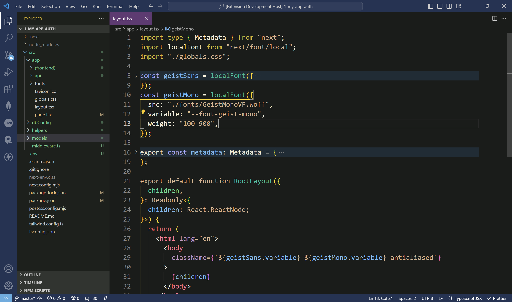

# Devyasa Dark Theme

**Devyasa Dark Spiritual** is a meticulously crafted dark theme for Visual Studio Code, designed to provide a calming and visually pleasing coding environment. With harmonious colors inspired by spiritual vibes, this theme aims to enhance your focus and productivity, especially for web development languages.

<!--  -->

---

### ✨ Features

- **Eerie Black Background**: A dark, serene background that reduces eye strain and helps you concentrate.
- **Divine White Foreground**: Clear and crisp text for better readability, ensuring you don’t miss a single detail.
- **Tranquil Blue Accents**: Soothing blue highlights create a peaceful coding experience, making your work more enjoyable.
- **Harmony Beige and Sacred Violet Elements**: Soft, balanced colors provide a harmonious look, making long coding sessions easier on the eyes.
- **Custom Debugger and Editor Colors**: Tailored settings for a seamless debugging experience, helping you catch errors quickly and efficiently.

### 🖼️ Snapshots

#### Editor View

<!-- #### Debugging

#### Terminal

 -->

### 🛠️ Installation

1. **Open Visual Studio Code**.
2. **Go to the Extensions view** (`Ctrl+Shift+X` or `Cmd+Shift+X` on macOS).
3. **Search for "Devyasa Dark"**.
4. **Click Install** to install the theme.
5. **Select the theme**: Go to `File` -> `Preferences` -> `Color Theme` and choose "Devyasa Dark Spiritual".

### 🌟 Contributing

We welcome contributions! Feel free to submit issues or pull requests to help improve the theme. Contributions are always appreciated!

### 📜 License

This theme is licensed under the [MIT License](LICENSE).

---

### Tips

- Ensure that the image paths are correct and relative to your README file location.
- Use meaningful filenames for your snapshots to make it easier to understand their content.

By following these steps, your README file will be more engaging and informative, showcasing your theme in action.

If you need any further assistance or specific adjustments, feel free to let me know! 😊🚀
